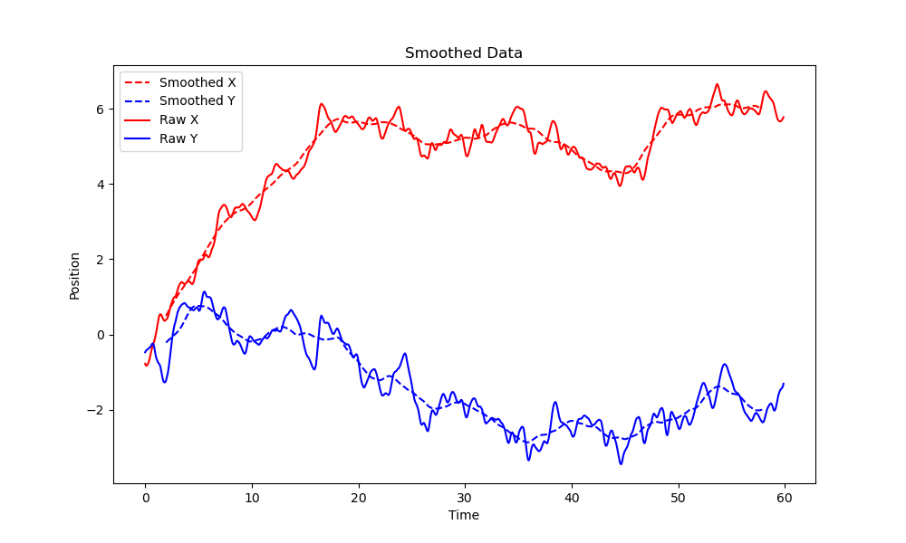

# ProprioSuite

## Overview

**ProprioSuite** is an open-source package designed for two proprioceptive testing paradigms: the pointing task and the weight discrimination task. The pointing task measures proprioception, while the weight discrimination task measures whether we can discriminate between different weights. This project aims to provide a standardized pipeline for the intricate data analysis following these tests, especially in scenarios where others may conduct the same tests and require analysis.

For instructions on how the tasks are performed, see their documentation:

[Pointing Task]()

[Weight Discrimination Task]()

### Features

- An independent 2D smoothing module with the most commonly used smoothing methods (see [instructions](#usage))
- Modular statistical analysis for raw data from the tests.
- Publicly available database for subjects without a known neurological condition.
- Comparison baseline for others to analyze their data and compare subjects to the normal range.
- Performance report generation.
- Modules: `PointingTask` and `WeightDiscrimination`.

### Application in Industry

This project is primarily targeted at healthcare and somatosensory research.

## Technical Details

- **Programming Language**: Python
- **Dependencies**: List of packages (to be updated later)
- **Architecture**: The package consists of two modules - `PointingTask` and `WeightDiscrimination`. Each module contains analyses, figures, comparison tools, and a performance report generator specific to its task.

## Getting Started

### Prerequisites

- Python (preferably 3.6 or higher)
- Ensure you have `pip` and `setuptools` installed. Most Python installations already include them, but if not, you can install them using:

```bash
pip install pip setuptools --upgrade
```

### Installation

You can install the package directly from GitHub using pip:

```bash
pip install git+https://github.com/yurisugano/ProprioSuite.git
```

After the installation, you can import the package in your Python code:

```python
import ProprioSuite
```

### Usage

**ProprioSuite** contains a module with several smoothing methods for 2D data, which can useful in different applications. This module offers various smoothing methods to refine your data, including Moving Average, Weighted Moving Average, Exponential Moving Average, Gaussian Smoothing, Savitzky Golay, and Median Filter.

Clone this repository following the instructions above, make sure to install all dependencies

```bash
pip install scipy numpy pandas matplotlib
```

Sample data should a 2D numpy array where:

First column: Time
Second column: X coordinate
Third column: Y coordinate

```python
data = np.array([
    [0.0, -0.778, -0.475],
    [0.04, -0.811, -0.449],
    ...
])

smoothed_data_object = smooth_data(data, MovingAverage, window_size=100)
```

You can then retrieve the smoothed data with the method `.get_data()` and see the results of smoothing with `.show_plot()`

```
smoothed_data = smoothed_data_object.get_data()
smoothed_data_object.show_plot()
```
<p align="center">
  
</p>


## Project Status

The codebase is complete, but the project is in the process of being organized into a package for publication. All analyses can currently be performed using the scripts locally.

### Milestones

- Raw data analysis
- Feature extraction
- Comparison to normal range
- Performance reports

### Collaboration

Open to collaborations. If interested in using the package for tests and analysis, please reach out for a smooth integration and direct bug resolution.

## Additional Information

- Publicly available, unidentifable data on 60 subjects without a known neurological condition.
- Raw data details:
  - PointingTask: Finger position across time database with time intervals (typically 1/30 s for 30fps recordings), x and y position.
  - WeightDiscrimination: See the [sample data]()

For more information, questions, or collaborations, visit [my home page](#).

